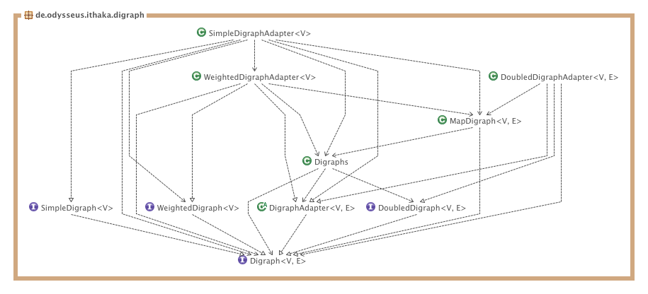

# Ithaka Digraph

[_Ithaka Digraph_](http://beckchr.github.com/ithaka-digraph/) provides a framework for directed graphs.

## Features

- Simple digraphs (without edge weights)
- Weighted digraphs (with integer edge weights)
- Double-linked digraphs (to access reverse digraph and incoming edges efficiently)
- Map-based digraph implementation
- Basic algorithms (transitive closure, topological search, strongly/weakly connected components...)
- Hierarchical layout (Sugiyama) implementation
- GraphML export functionality (experimental)

## Survey

Here's a brief introduction the core interfaces and classes.

As a side note, the above image has been rendered from a layout computed by _Ithaka Digraph_.

### Digraph Interface

The interface `Digraph<V,E>` is a generic type, where `V` denotes the vertex type and `E` denotes the edge type.

Vertices are added with

	boolean add(V vertex); // add a vertex

When putting edges, nodes are lazily added.

	E put(V source, V target, E edge); // put edge from source to target

Vertices and edges can be removed with

	boolean remove(V vertex); // remove single vertex and adjacent edges
	void removeAll(Collection<V> vertices); // remove several  odes at once
	E remove(source, target); // remove a single edge

You can test if a graph contains a vertex or edge with

	boolean contains(Object vertex);
	boolean contains(Object source, Object target);

Getting an edge value is done with

	E get(Object source, Object target);

The vertices can be iterated using

	Iterable<V> vertices();

To iterate over edges starting at a given source vertex, use

	Iterable<E> targets(vertex);

To serve basic graph properties, we have:

	int getVertexCount(); // number of vertices in the graph
	int getEdgeCount(); // number of edges in the graph
	int getOutDegree(Object vertex); // number of outgoing edges
	boolean isAcyclic(); // true if and only if graph is cycle-free

In addition, there are some methods producing new graphs:

	Digraph<V,E> reverse(); // create graph with reverse edge direction
	Digraph<V,E> subgraph(Set<V> vertices); // create subgraph of given vertices

### MapDigraph Class

The `MapDigraph<V,E>` class implements the `Digraph<V,E>` interface, using nested maps to store vertices
and edges (i.e. `Map<V, Map<V, E>>`).

	Digraph<V,E> digraph = new MapDigraph<V,E>();

There are several constructors to allow control of the type of maps used to store vertices and edges.

### SimpleDigraph Interface

The `SimpleDigraph<V>`interface extends `Digraph<V,Boolean>` (i.e. it doesn't care about edge values) and
adds convenience method

	boolean add(V source, V target); // add an edge from source to target

### WeightedDigraph Interface

The `WeightedDigraph<V>` interface extends `Digraph<V,Integer>` (i.e. has integer weights) and
adds convenience methods

	void add(V source, E target, int weight); // add edge weight (atomatically inserts the edge if necessary)
	int digraph.totalWeight(); // sum of all edge weights

### DoubledDigraph Interface

The `DoubledDigraph<V,E>` interface extends `Digraph<V,E>` and internally maintains the reverse graph,
providing additional methods

	Iterable<V> sources(Object vertex);
	int getInDegree(Object vertex);

### DigraphAdapter Classes

The abstract `DigraphAdapter<V,E>` class implements a `Digraph<V,E>` by taking an existing `Digraph<V,E>`
at construction time and delegating all methods to it. Class `DigraphAdapter` is extended by

	SimpleDigraphAdapter<V> extends DigraphAdapter<V,Boolean> implements SimpleDigraph<V> { ... }
	WeightedDigraphAdapter<V> extends DigraphAdapter<V,Integer> implements WeightedDigraph<V> { ... }
	DoubledDigraphAdapter<V,E> extends DigraphAdapter<V,E> implements DoubledDigraph<V,E> { ... }

### Digraphs Class

The `Digraphs` class provides static utility methods ala `Collections`. To name a few:

	<V,E> DoubledDigraph<V,E> emptyDigraph(); // get an unmodifiable empty digraph
	<V,E> Digraph<V,E> unmodifiableDigraph(Digraph<V,E> digraph) // wrap graph to make it unmodifiable 
	<V> List<V> topsort(Digraph<V,?> digraph, boolean descending); // perform topological sort
	<V> Set<V> closure(Digraph<V,?> digraph, V source); // compute transitive closure
	<V> boolean isAcyclic(Digraph<V,?> digraph); // test for cycle-freeness
	<V> boolean isStronglyConnected(Digraph<V,?> digraph); // test for strong connectivity
	<V> boolean isReachable(Digraph<V,?> digraph, V source, V target); // test for existing path
	<V> List<Set<V>> scc(Digraph<V,?> digraph); // compute strongly conntected components
	<V> List<Set<V>> wcc(Digraph<V,?> digraph); // compute weakly connected components
	...

### Layout Sample

	SimpleDigraph<Integer> digraph = new SimpleDigraphAdapter<Integer>();
	digraph.add(1, 2);
	digraph.add(1, 3);
	digraph.add(2, 3);

	LayoutDimensionProvider<Integer> dimensionProvider = new LayoutDimensionProvider<Integer>() {
		@Override
		public LayoutDimension getDimension(Integer node) {
			return new LayoutDimension(String.valueOf(node).length(), 1);
		}
	};
	LayoutBuilder<Integer,Boolean> builder = new SugiyamaBuilder<Integer, Boolean>(1, 1);
	Layout<Integer,Boolean> layout = layouter.layout(digraph, dimensionProvider);
	for (LayoutNode<Integer> vertex : layout.getLayoutGraph().vertices()) {
		System.out.println(node.getVertex() + " --> " + vertex.getPoint());
	}

prints

	1 --> (1,0)
	2 --> (0,2)
	3 --> (1,4)

_Ithaka Digraph_ does not contain code to render layouts.

## Downloads

Add Maven repository

	<repository>
		<id>ithaka</id>
		<url>http://beckchr.github.com/ithaka-maven/mvnrepo/</url>
	</repository>

as well as dependency

	<dependency>
		<groupId>de.odysseus.ithaka</groupId>
		<artifactId>ithaka-digraph</artifactId>
		<version>0.9</version>
	</dependency>

or manually grab JARs [here](http://beckchr.github.com/ithaka-maven/mvnrepo/de/odysseus/ithaka/ithaka-digraph/0.9). 

## License

_Ithaka Digraph_ is available under the [Apache License, Version 2.0](http://www.apache.org/licenses/LICENSE-2.0.html).

_(c) 2012 Odysseus Software_